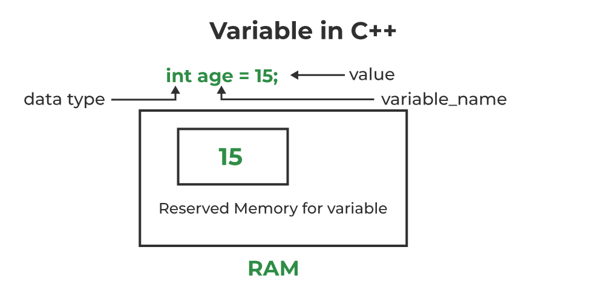
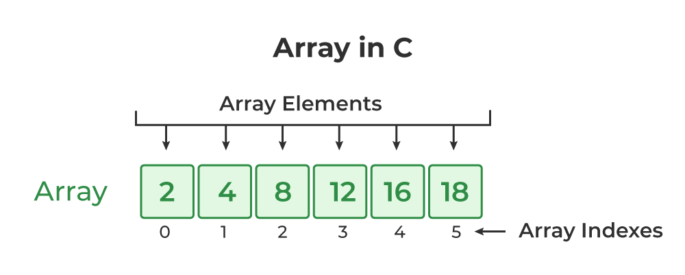

# Panduan Pemrograman menggunakan Bahasa C by Xeranov

<!-- logika dasar dan algortima  pemrograman -->

## **BAB 1 Tipe Data Dan Variabel**

### A. tipe data

1. int: Digunakan untuk menyimpan bilangan bulat.
2. float: Digunakan untuk menyimpan bilangan desimal dengan presisi tunggal.
3. double: Digunakan untuk menyimpan bilangan desimal dengan presisi ganda.
4. char: Digunakan untuk menyimpan karakter.

contoh code:

1. `int umur = 25;`
2. `float harga = 10.5; `
3. `double nilai = 3.14159; `
4. `char huruf = 'A'; `

Dalam bahasa C tidak ada tipe data khusus untuk mendeklarasikan string. Untuk String Akan kita bahas pada bab selanjutnya.

### B. Deklarasi Variabel

Deklarasi variabel dalam bahasa pemrograman adalah langkah untuk memberitahu komputer tentang nama variabel yang akan digunakan dalam program,
serta tipe data yang akan disimpan di dalamnya.
Di C, deklarasi variabel biasanya terdiri dari dua bagian utama: nama variabel dan tipe data.

Contohnya :

`int umur = 25;` //dalam kode ini kita mendeklarasikan variabel bernama umur dengan tipe data integer (int) dan nilainya adalah angka 25



coba jelaskan kode kode berikut ini berdasarkan yang sudah kita pelajari di atas

`float harga = 10.5;`

`double nilai = 3.14159;`

`char huruf = 'A';`

## BAB 2 Array

### A. Array

Array di bahasa C adalah struktur data yang digunakan untuk menyimpan kumpulan elemen dengan tipe data yang sama dalam urutan tertentu.
Setiap elemen dalam array diakses menggunakan indeks numerik, yang dimulai dari 0.

Deklarasi array dalam bahasa C dilakukan dengan menentukan tipe data elemen yang akan disimpan dalam array,
diikuti dengan nama array, dan ukuran array dalam kurung siku ([]).

Misalnya:
`int angka[5];` // Deklarasi array integer dengan 5 elemen

kita sudah mendeklarasikan array bernama angka yang dapat menyimpan 5 bilangan bulat.
ini berarti kita dapat mendeklarasikan 5 angka di dalam satu variabel bernama angka
Setelah array dideklarasikan, kita dapat mengakses setiap elemennya menggunakan indeks numerik, mulai dari 0 hingga ukuran array dikurangi satu.

Misalnya:
`angka[0] = 10;` Mengatur nilai elemen pertama dari array angka menjadi 10
`angka[1] = 20;` Mengatur nilai elemen kedua dari array angka menjadi 20

Kita juga bisa menginisialisasi array saat mendeklarasikannya. Misalnya:

`int angka[5] = {10, 20, 30, 40, 50};` Mendeklarasikan dan menginisialisasi array integer dengan 5 elemen Array



Bingung? mari kita menggunakan imajinasi
bayangkan kamu memiliki 1 garasi yang bisa menampung 5 mobil kamu
code nya akan seperti ini :

char garasi[5];

kamu baru saja membuat garasi barumu
[] [] [] [] [] //bayangkan ini garasimu

dalam array kita menghitung secara index yang dimana berarti kita menghitung dimulai dari 0

```[] [] [] [] []
^ ^ ^ ^ ^
0 1 2 3 4
```
sekarang kita masukkan mobil kedalam garasimu, gini kodenya

`garasi[0] = "mobil1";` <-ini akan memasukkan mobilmu ke garasi pertama mari kita bedah kodenya

1. 0 disini artinya slot garasi pertama, kenapa? seperti yang kita lihat tadi array dimulai dari 0 jadi kita input di 0 karna kita mau memasukkan di garasi pertama.
2. garasi disini mengambil nama array yang sudah kita deklarasi sebagai garasi

mari kita lihat garasi kita sekarang
```
[mobil1] [] [] [] []
^ ^ ^ ^ ^
0 1 2 3 4
```
bagus mobil mu sudah masuk ke garasi pertama. sekarang kamu sudah mengerti cara menggunakan array coba kamu masukkan sendiri mobil mobil kamu kedalamnya

[mobil 1] [mobil 2] [mobil 3] [mobil 4] [mobil 5]

disini kita sudah memasukkan 5 mobil kedalam garasi kita
